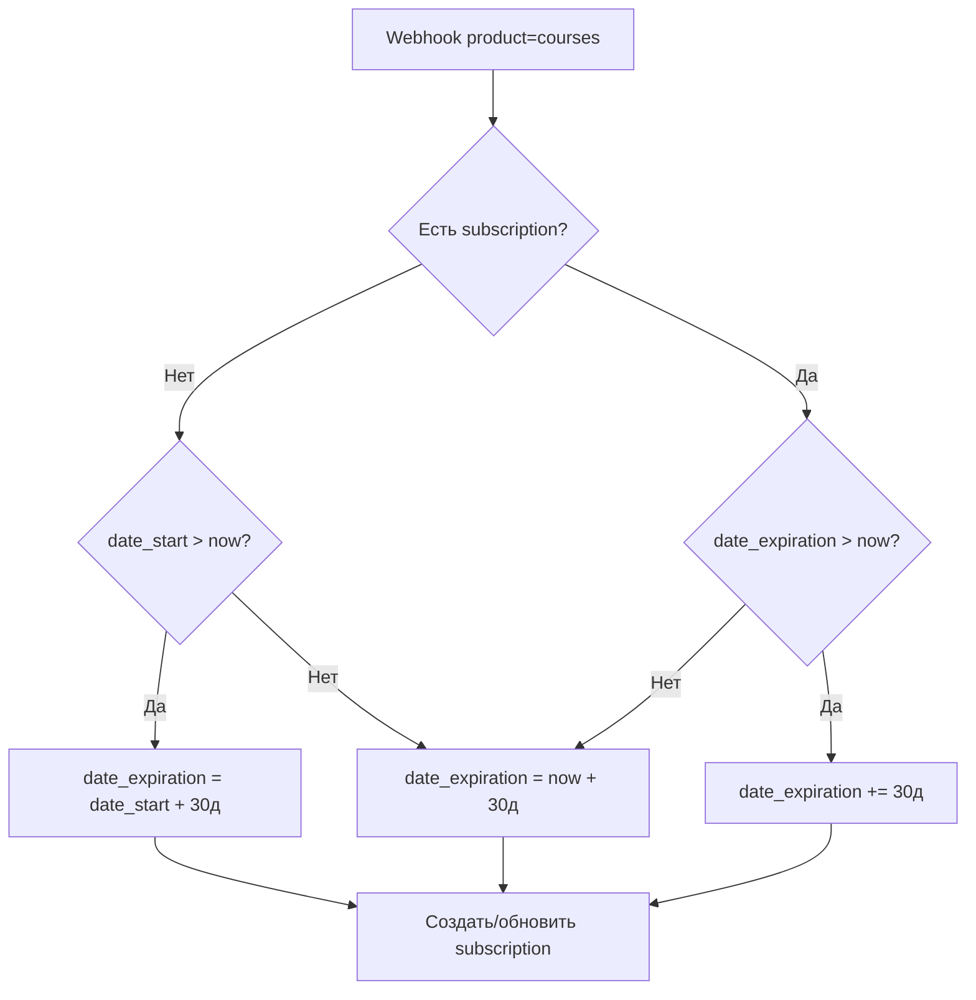

# План: Покупка подписки и мерча через ЮКасса

## Текущее состояние

- Directus — база, пользователи в стандартной таблице `directus_users`, курсы (коллекция `courses`)
- Next.js — API routes `/api/data/read`, `/api/data/user`, авторизация через `directus_token` и Telegram
- Подписки ожидаются как `user.subscriptions` с полями: `id`, `course`, `amount`, `currency`, `date_expiration`
- Сейчас кнопка «Купить» в `[CardCourse.tsx](src/components/share/courses/CardCourse.tsx)` — заменить на in-app оплату

---

## 1. Виды товаров

- **Подписка** — доступ к курсу на месяц, при повторной покупке срок продлевается
- **Мерч** — разовая покупка товара (футболки, аксессуары и т.п.)

---

## 2. Коллекции Directus

### 2.1 `directus_users` (стандартная)

Используется как есть. В расширениях/отношениях — связь с `subscriptions` и `payments`.

### 2.2 Коллекция `courses`

| Поле                 | Тип                  | Описание                          |
| -------------------- | -------------------- | --------------------------------- |
| `id`                 | UUID (auto)          | PK                                |
| `status`             | String               | open / close                      |
| `date_start`         | Date                 | Дата старта курса                 |
| `level`              | String               | easy / medium / hard              |
| `cover`              | M2O → directus_files | Обложка                           |
| `title`              | String               | Название                          |
| `brief_description`  | Текст/HTML           | Краткое описание                  |
| `description`        | Текст/HTML           | Полное описание                   |
| `training_length`    | String               | Длина курса (например «4 недели») |
| `subscription_price` | Decimal (точность)   | Цена месячной подписки (добавить) |
| `weeks`              | O2M → weeks          | Недели курса → тренировки         |
| `date_created`       | Timestamp (auto)     | —                                 |

### 2.3 Коллекция `subscriptions`

| Поле              | Тип                  | Описание                |
| ----------------- | -------------------- | ----------------------- |
| `id`              | UUID (auto)          | PK                      |
| `user`            | M2O → directus_users | Пользователь            |
| `course`          | M2O → courses        | Курс                    |
| `date_expiration` | DateTime             | Дата окончания подписки |
| `amount`          | Decimal              | Сумма последней оплаты  |
| `currency`        | String (10)          | Валюта (RUB)            |
| `date_created`    | Timestamp (auto)     | Дата создания           |

Один ряд на пару (user, course) с обновлением `date_expiration` при продлении.

### 2.4 Коллекция `merch`

| Поле           | Тип                  | Описание          |
| -------------- | -------------------- | ----------------- |
| `id`           | UUID (auto)          | PK                |
| `title`        | String               | Название          |
| `price`        | Decimal              | Цена              |
| `currency`     | String (10)          | Валюта            |
| `image`        | M2O → directus_files | Изображение       |
| `status`       | String               | draft / published |
| `date_created` | Timestamp (auto)     | —                 |

### 2.5 Коллекция `payments`

| Поле                  | Тип                   | Описание                                |
| --------------------- | --------------------- | --------------------------------------- |
| `id`                  | UUID (auto)           | PK                                      |
| `yookassa_payment_id` | String (50)           | ID платежа в ЮКасса                     |
| `user`                | M2O → directus_users  | Пользователь                            |
| `products`            | M2A (Items, multiple) | Товары; коллекции: `courses`, `merch`   |
| `amount`              | Decimal               | Сумма                                   |
| `currency`            | String                | Валюта                                  |
| `status`              | String (20)           | pending / succeeded / canceled / failed |
| `metadata`            | JSON                  | Доп. данные от ЮКасса                   |
| `date_created`        | Timestamp (auto)      | Дата создания                           |

**M2A поле `products`:** тип Items (множественный) в Directus, разрешённые коллекции — `courses`, `merch`. Один платёж может содержать несколько товаров (подписки и/или мерч). Тип каждого определяется по `item.collection`.

---

## 3. Связи в Directus

- `directus_users` → `subscriptions` (O2M), `directus_users` → `payments` (O2M)
- `courses` → `subscriptions` (O2M)
- `courses`, `merch` → `payments` через M2A поле `products`
- Права: пользователь видит только свои подписки/платежи.

---

## 4. API в Next.js

### 4.1 POST `/api/payments/create`

**Запрос:** `{ products: [{ collection: "courses" | "merch", id: string }] }`  
**Проверки:** авторизация (cookies `directus_token` или `auth_token`), существование всех товаров, массив не пустой.

**Логика:**

1. Получить `userId` из сессии.
2. Для каждого товара определить цену (`courses.subscription_price` или `merch.price`), сумма = total.
3. Вызвать ЮКаassa API (`POST /v3/payments`): `amount` (total), `currency`, `confirmation.return_url`, `metadata: { userId, products: [...] }`.
4. Создать в Directus запись `payments` (status: `pending`, `products`: массив M2A `{ collection, item }`).
5. Вернуть `{ confirmation_url, payment_id }`.

### 4.2 POST `/api/payments/webhook`

Обработка уведомлений ЮКасса о смене статуса платежа.

**Логика:**

1. Проверить подпись запроса (если настроена).
2. На `payment.succeeded`:

- Найти `payment` по `yookassa_payment_id`.
- Для каждого элемента в `payment.products` (или из metadata):
  - **courses** (подписка): загрузить `course` (нужен `date_start`); найти subscription по `(user, course)` или создать; выставить `date_expiration` по правилам из раздела 5.
  - **merch**: без дополнительной логики (доставка — отдельно).
- Обновить `payments.status = succeeded`.

1. Сохранить изменения в Directus. Обработка идемпотентна (не дублировать при повторном webhook).

### 4.3 Запрос пользователя с подписками

Текущий `/api/data/user` возвращает `readMe()`. Расширить запрос Directus, чтобы включать связанные `subscriptions`.

---

## 5. Логика `date_expiration` при покупке подписки

Используется `course.date_start`. 30 дней — duration подписки.

**Нет подписки** (создаём):

- `date_start` > now → `date_expiration = date_start + 30 дней`
- `date_start` ≤ now → `date_expiration = now + 30 дней`

**Подписка есть**:

- `date_expiration` > now → `date_expiration += 30 дней`
- `date_expiration` ≤ now → `date_expiration = now + 30 дней`

---

## 6. Фронтенд

- Подписка: `[CardCourse.tsx](src/components/share/courses/CardCourse.tsx)` — вызывать `POST /api/payments/create` с `products: [{ collection: "courses", id: course.id }]`, перенаправлять на `confirmation_url`.
- Мерч: `products: [{ collection: "merch", id }]`. Корзина: массив нескольких товаров в одном платеже.
- Страница результата оплаты: `/payment` — универсальная страница, принимает query-параметр (`?status=success`, `?status=canceled` и т.п.) и в соответствии с ним выводит `[Notice.tsx](src/components/Notice.tsx)`. После `status=success` — invalidate React Query. В API: `return_url` = `${NEXT_PUBLIC_APP_URL}/payment?status=success`.
- `[Subscriptions.tsx](src/components/profile/Subscriptions.tsx)`: кнопки «Продлить» — flow через `/api/payments/create`.

---

## 7. Переменные окружения

| Переменная            | Описание                                 |
| --------------------- | ---------------------------------------- |
| `YOOKASSA_SHOP_ID`    | ID магазина                              |
| `YOOKASSA_SECRET_KEY` | Секретный ключ                           |
| `SUBSCRIPTION_PRICE`  | Цена подписки в рублях (если не в курсе) |
| `NEXT_PUBLIC_APP_URL` | Базовый URL для return_url               |

---

## 8. Webhook в ЮКасса

В кабинете ЮКасса создать webhook:

- URL: `https://your-domain.com/api/payments/webhook`
- События: `payment.succeeded`, `payment.canceled` (опционально)

---

## 9. Изменения в существующих коллекциях Directus

**courses:**

- `subscription_price` (Decimal) — цена месячной подписки.
- `date_start` (Date) — дата старта курса (уже есть).

**merch** — новая коллекция (см. п. 2.4).

---

## Важные моменты

- Пользователи — стандартная таблица `directus_users`.
- Виды товаров: подписка (продление срока) и мерч (разовая покупка).
- Создание платежа — только с сервера через admin Directus.
- Webhook обрабатывать идемпотентно (проверка `payments.status`).
- `useUser` / `useApp` — реализовать или заменить на `useAuth` + `useData`.
